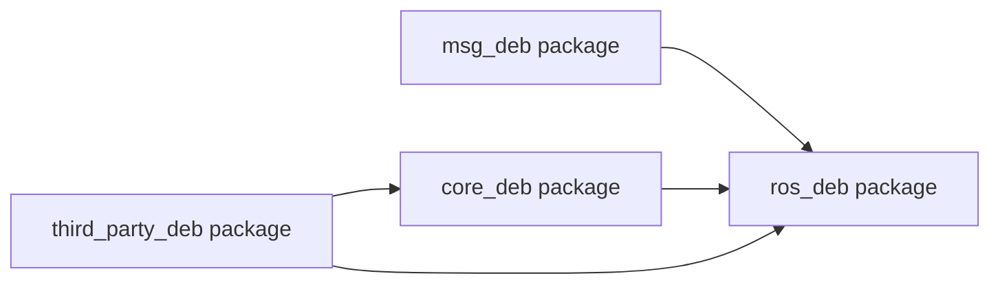

# 移动感知打包文档

# **文档概要**

本文是一个通用说明，用于介绍移动感知模块的标准文件组织方式、交付形式、打包流程、部署流程。  

当前项目以及后续同类模块，原则上都按照 msg、ros、core、third\_party 四类 deb 包进行拆分与集成。

本文面向开发人员、外部协作者、测试人员、集成人员和交付人员。 

# **模块文件说明 **

## **标准包关系图**




## **包职责说明**

- msg deb package

    - 提供模块对外通信所需的消息、服务等接口定义。

    - 该包是接口层，主要用于统一上下游之间的数据格式。

    - 其他功能包如果需要与模块交互，通常首先依赖这一层。

- ros deb package

    - 这是模块的对外交互层和适配层，通常作为一个整体交付。

    - ros 负责 ROS 节点、话题订阅与发布、服务暴露，以及运行时管理。

    - adapter 负责把 ROS 接口和内部算法接口连接起来，完成数据转换、流程衔接和调用封装。

    - 外部系统通常直接集成这一层，以获得完整的模块能力。

- core deb package

    - 提供模块的核心算法能力。

    - 这一层通常不直接对外暴露 ROS 接口，而是通过 \`adapter\` 被上层调用。

    - 将核心算法独立成包，便于算法升级、复用和版本管理。

- third\_party deb package

    - 提供模块运行所需的第三方库、公共基础能力或外部依赖。

## **为什么采用这种拆分方式**

- 便于职责分离。接口、运行层、算法层、第三方依赖各自独立，边界清晰。

- 便于独立发布。不同层可以按需升级，不必每次整体重打包。

- 便于跨模块复用。多个模块可以共用同一套 msg 规范、third\_party 依赖，甚至复用相同的 core 能力设计方式。

- 便于外部集成。外部人员只需理解包职责和依赖关系，无需深入代码细节即可完成部署和联调。

# **打包流程**

## **nviz\_core**

### **地址说明**

- jenkins地址 账号admin 密码 admin

    - http://10\.51\.33\.211:8080/view/alg\_core/job/nviz\_core/build?delay=0sec

- deb包地址

    - release:http://10\.51\.33\.211:10000/\#/modules/nviz/release/nviz

    - debug:http://10\.51\.33\.211:10000/\#/modules/nviz/debug/nviz

### **完整流程**

- 进入到jenkins界面

- 设置参数（如下4个参数必填）

    - ALGO\_BUILD\_SOURCE：决定采用tag还是branch。

    - ALGO\_BRANCH：如果选择BRANCH就设置这个参数。

    - ALGO\_TAG：如果选择TAG就设置这个参数。

    - BUILD\_PACKAGE\_MODE：选择debug还是release，最好调试用debug，发版用release
- 点击build
- 下载成果物

    - 根据BUILD\_PACKAGE\_MODE到对应的deb路径去下载deb包。

    - 包名组成：release包后缀只加上VERSION，debug还会额外加上git信息。
## **navigation\_core**

### **地址说明**

- jenkins地址 账号admin 密码 admin

    - http://10\.51\.33\.211:8080/view/alg\_core/job/navigation\_core/build?delay=0sec

- deb包地址

    - release:http://10\.51\.33\.211:10000/\#/modules/navigation/release/navigation

    - debug:http://10\.51\.33\.211:10000/\#/modules/navigation/debug/navigation

### **完整流程**

- 进入到jenkins界面
- 设置参数（如下5个参数必填）

    - ALGO\_BUILD\_SOURCE：决定采用tag还是branch。

    - ALGO\_BRANCH：如果选择BRANCH就设置这个参数。

    - ALGO\_TAG：如果选择TAG就设置这个参数。

    - BUILD\_PACKAGE\_MODE：选择debug还是release，最好调试用debug，发版用release

    - VERSION：为算法版本，可由算法自行管理。（注：需要以数字开头）
- 点击build
- 下载成果物

    - 根据BUILD\_PACKAGE\_MODE到对应的deb路径去下载deb包。

    - 包名组成：release包后缀只加上VERSION，debug还会额外加上git信息。
## **location\_core**

### **地址说明**

- jenkins地址 账号admin 密码 admin

    - http://10\.51\.33\.211:8080/view/alg\_core/job/location\_core/build?delay=0sec

- deb包地址

    - release:http://10\.51\.33\.211:10000/\#/modules/perception/release/wa\_location\_core

    - debug:http://10\.51\.33\.211:10000/\#/modules/perception/debug/wa\_location\_core

### **完整流程**

- 进入到jenkins界面

- 设置参数（如下6个参数必填）

    - BUILD\_SOURCE：决定采用tag还是branch。

    - BRANCH：如果选择BRANCH就设置这个参数。

    - TAG：如果选择TAG就设置这个参数。

    - UBUNTU\_VERSION：可选2004/2204

    - PACKAGE\_VERSION：为算法版本，可由算法自行管理。（注：需要以数字开头）

    - BUILD\_PACKAGE\_MODE：选择debug还是release，最好调试用debug，发版用release
- 点击build
- 下载成果物

    - 根据BUILD\_PACKAGE\_MODE到对应的deb路径去下载deb包。

    - 包名组成：release包后缀只加上VERSION，debug还会额外加上git信息。
## **mapping\_core**

### **地址说明**

- jenkins地址 账号admin 密码 admin

    - http://10\.51\.33\.211:8080/view/alg\_core/job/mapping\_core/build?delay=0sec

- deb包地址

    - release:http://10\.51\.33\.211:10000/\#/modules/perception/release/mapping\_core

    - debug:http://10\.51\.33\.211:10000/\#/modules/perception/debug/mapping\_core

### **完整流程**

- 进入到jenkins界面

- 设置参数（如下5个参数必填）

    - ALGO\_BUILD\_SOURCE：决定采用tag还是branch。

    - ALGO\_BRANCH：如果选择BRANCH就设置这个参数。

    - ALGO\_TAG：如果选择TAG就设置这个参数。

    - BUILD\_PACKAGE\_MODE：选择debug还是release，最好调试用debug，发版用release

    - VERSION：为算法版本，可由算法自行管理。（注：需要以数字开头）
- 点击build
- 下载成果物

    - 根据BUILD\_PACKAGE\_MODE到对应的deb路径去下载deb包。

    - 包名组成：release包后缀只加上VERSION，debug还会额外加上git信息。
## **perception\_core**

### **地址说明**

- jenkins地址 账号admin 密码 admin

    - http://10\.51\.33\.211:8080/view/alg\_core/job/perception\_core/build?delay=0sec

- deb包地址

    - release:http://10\.51\.33\.211:10000/\#/modules/perception/release/perception\_core

    - debug:http://10\.51\.33\.211:10000/\#/modules/perception/debug/perception\_core

### **完整流程**

- 进入到jenkins界面

- 设置参数（如下6个参数必填）

    - BUILD\_SOURCE：决定采用tag还是branch。

    - BRANCH：如果选择BRANCH就设置这个参数。

    - TAG：如果选择TAG就设置这个参数。

    - UBUNTU\_VERSION：可选2004/2204

    - PACKAGE\_VERSION：为算法版本，可由算法自行管理。（注：需要以数字开头）

    - BUILD\_PACKAGE\_MODE：选择debug还是release，最好调试用debug，发版用release
- 点击build
- 下载成果物

    - 根据BUILD\_PACKAGE\_MODE到对应的deb路径去下载deb包。

    - 包名组成：release包后缀只加上VERSION，debug还会额外加上git信息。
## location\_ros

### **地址说明**

- jenkins地址 账号admin 密码 admin

    - http://10\.51\.33\.211:8080/view/ROS2/job/location\_ros/build?delay=0sec

- deb包地址

    - release:http://10\.51\.33\.211:10000/\#/modules/perception/release/wa\_location\_ros1

    - debug:http://10\.51\.33\.211:10000/\#/modules/perception/debug/wa\_location\_ros1

### **完整流程**

- 进入到jenkins界面

- 设置参数（如下1个参数必填）

    - BUILD\_PACKAGE\_MODE：选择debug还是release，最好调试用debug，发版用release

- 点击build

- 下载成果物

    - 根据BUILD\_PACKAGE\_MODE到对应的deb路径去下载deb包。

    - 包名组成：release包后缀只加上VERSION，debug还会额外加上git信息。

## perception\_ros

### **地址说明**

- jenkins地址 账号admin 密码 admin

    - http://10\.51\.33\.211:8080/view/ROS2/job/perception\_ros/build?delay=0sec

- deb包地址

    - release:http://10\.51\.33\.211:10000/\#/modules/perception/release/perception\_ros1

    - debug:http://10\.51\.33\.211:10000/\#/modules/perception/debug/perception\_ros1

### **完整流程**

- 进入到jenkins界面

- 设置参数（如下1个参数必填）

    - BUILD\_PACKAGE\_MODE：选择debug还是release，最好调试用debug，发版用release

- 点击build

- 下载成果物

    - 根据BUILD\_PACKAGE\_MODE到对应的deb路径去下载deb包。

    - 包名组成：release包后缀只加上VERSION，debug还会额外加上git信息。

# 部署流程（本地部署）

## nviz

```YAML
# 进入到deb包路径
cd /home/naviai/navi_project/.dists/nviz

# 删除带有nviz的deb包
rm -r *nviz*.deb

# 复制上述打印的包到这个文件夹

# 重启容器
cd /home/naviai/navi_project
docker compose down nviz
docker compose up -d nviz
```

## navigation

```YAML
# 进入到deb包路径
cd /home/naviai/navi_project/.dists/navigation

# 删除带有nviz的deb包
rm -r *navigation*.deb

# 复制上述打印的包到这个文件夹

# 重启容器
cd /home/naviai/navi_project
docker compose down navigation
docker compose up -d navigation
```

## location

```YAML
# 进入到deb包路径
cd /home/naviai/navi_project/.dists/perception 

# 删除带有nviz的deb包
rm -r *location_core*.deb

# 复制上述打印的包到这个文件夹

# 重启容器
cd /home/naviai/navi_project
docker compose down perception
docker compose up -d perception
```

## mapping

```YAML
# 进入到deb包路径
cd /home/naviai/navi_project/.dists/perception

# 删除带有nviz的deb包
rm -r *mapping*.deb

# 复制上述打印的包到这个文件夹

# 重启容器
cd /home/naviai/navi_project
docker compose down perception
docker compose up -d perception
```

## perception

```YAML
# 进入到deb包路径
cd /home/naviai/navi_project/.dists/perception

# 删除带有nviz的deb包
rm -r *perception_core*.deb

# 复制上述打印的包到这个文件夹

# 重启容器
cd /home/naviai/navi_project
docker compose down perception
docker compose up -d perception
```


