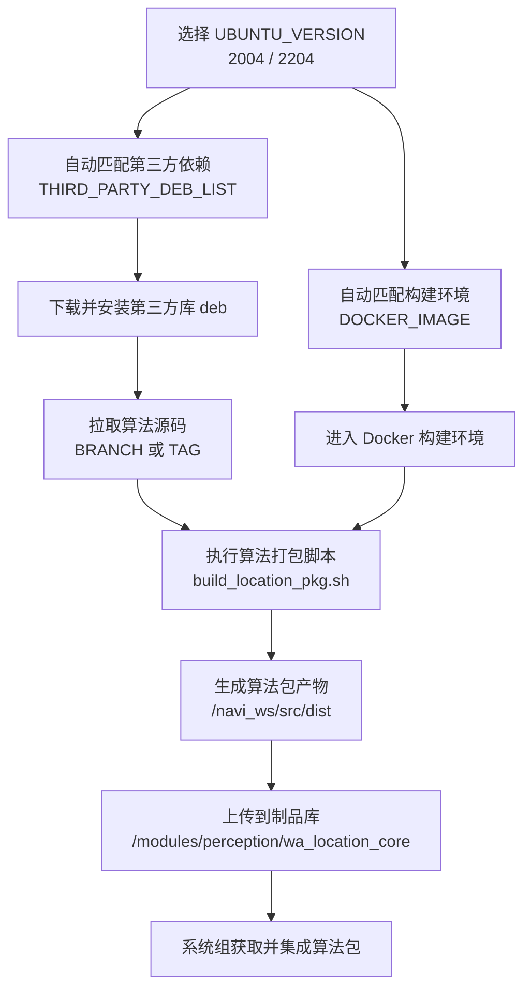

# 算法系统构建指南

本文档用于指导算法同事在 Jenkins UI 上正确配置参数，并完成算法包构建与上传。

以下将以location打包作为案例进行步骤描述。

**注：当模式为release的时候，填版本号时需要谨慎，如果文件服务器上有相同的版本文件，会覆盖掉同名文件。**

## **入口地址**

- Jenkins 任务路径：账号:admin  密码:admin

    - location:http://10\.51\.33\.211:8080/view/alg\_core/job/location\_core/

    - mapping:http://10\.51\.33\.211:8080/view/alg\_core/job/mapping\_core/

    - perception:http://10\.51\.33\.211:8080/view/alg\_core/job/perception\_core/

    - navigation:http://10\.51\.33\.211:8080/view/alg\_core/job/navigation\_core/

- 算法包产物路径（release）：

    - location:

        - http://10\.51\.33\.211:10000/\#/modules/perception/release/wa\_location\_core

        - http://10\.51\.33\.211:10000/\#/modules/perception/debug/wa\_location\_core

    - mapping:

        - http://10\.51\.33\.211:10000/\#/modules/perception/release/mapping\_core

        - http://10\.51\.33\.211:10000/\#/modules/perception/debug/mapping\_core

    - perception:

        - http://10\.51\.33\.211:10000/\#/modules/perception/release/perception\_core

        - http://10\.51\.33\.211:10000/\#/modules/perception/debug/perception\_core

    - navigation：

        - http://10\.51\.33\.211:10000/\#/modules/navigation/release/navigation

        - http://10\.51\.33\.211:10000/\#/modules/navigation/debug/navigation

## **构建目标**

当前 jenkinsfile 的构建流程是：

- 拉取算法仓库代码（分支或 Tag）。

- 根据 Ubuntu 版本自动选择 Docker 镜像与第三方依赖包。

- 先安装第三方 deb，再构建算法包。

- 上传构建产物到共享目录。

## **Jenkins UI 参数说明**

以下参数在 Jenkins 页面点击 Build with Parameters 时可见。

|**参数名**|**类型**|**含义**|**推荐配置**|
|---|---|---|---|
|`BUILD_SOURCE`|选择项|代码来源类型：`BRANCH` 或 `TAG`|日常开发选 `BRANCH`；正式发版选 `TAG`|
|`BRANCH`|Git 分支|当 `BUILD_SOURCE=BRANCH` 时生效|选择目标分支，例如 `dev/jenkins`|
|`TAG`|Git 标签|当 `BUILD_SOURCE=TAG` 时生效|选择发布标签，例如 `1.3.0`|
|`IS_PREJECT_NOTIFY`|选择项|是否推送飞书通知|默认 `False` 即可|
|`IS_BUILD_DOCKER_IMAGE`|选择项|是否构建 Docker 镜像|默认 `False` 即可|
|`UBUNTU_VERSION`|选择项|构建环境版本：`2004` 或 `2204`|按目标部署环境选择|
|`PACKAGE_VERSION`|字符串|算法包版本号|例如 `1.3.0`、`1.3.1`|
|`BUILD_PACKAGE_MODE`|选择项|打包模式：`release` 或 `debug`|发布用 `release`，排障用 `debug`|

## **关键联动关系（非常重要）**

- BUILD\_SOURCE=BRANCH时，以 BRANCH 为准；TAG 会被忽略。  

- BUILD\_SOURCE=TAG时，以 TAG为准；BRANCH会被忽略。  

- UBUNTU\_VERSION会自动决定两件事（无需手工改脚本）：

    - DOCKER\_IMAGE（构建容器镜像）

    - THIRD\_PARTY\_DEB\_LIST（第三方依赖包路径）

- 构建脚本最终调用：release\_src/build\_location\_pkg\.sh \<PACKAGE\_VERSION\> \<BUILD\_PACKAGE\_MODE\>

## **推荐构建步骤（操作手册）**

- 进入 Jenkins 任务页面，点击 \`Build with Parameters\`。  

- 按需求填写参数：

    - 选来源：\`BUILD\_SOURCE\`。

    - 选代码：\`BRANCH\` 或 \`TAG\`。

    - 选系统：\`UBUNTU\_VERSION\`。

    - 填版本：\`PACKAGE\_VERSION\`。

    - 选模式：\`BUILD\_PACKAGE\_MODE\`。

- 点击构建，观察 Console 日志关键输出：

    - \`UBUNTU\_VERSION=\.\.\.\`

    - \`DOCKER\_IMAGE=\.\.\.\`

    - \`THIRD\_PARTY\_DEB\_LIST=\.\.\.\`

- 构建成功后，产物会上传到：

    - \`/modules/perception/\<BUILD\_PACKAGE\_MODE\>/wa\_location\_core\`

    - release 查看地址：\`http://10\.51\.33\.211:10000/\#/modules/perception/release/wa\_location\_core\`

## **常用配置示例**

### **规范**

- 版本命名：算法版本\-系统版本（例如：1\.0\.0\-2004）

- debug版本的包名会带commit id和tag号或者branch，release版本包名只包含版本号

### **示例 A：日常分支构建**

\- \`BUILD\_SOURCE=BRANCH\`

\- \`BRANCH=dev/jenkins\`

\- \`UBUNTU\_VERSION=2204\`

\- \`PACKAGE\_VERSION=2\.0\.0\`

\- \`BUILD\_PACKAGE\_MODE=debug\`

### **示例 B：正式发版构建**

\- \`BUILD\_SOURCE=TAG\`

\- \`TAG=v1\.3\.0\`

\- \`UBUNTU\_VERSION=2204\`

\- \`PACKAGE\_VERSION=2\.0\.0\`

\- \`BUILD\_PACKAGE\_MODE=release\`

## **流水线内部执行顺序（便于排查）**

- \`Get Branch\`：解析构建分支/标签信息。  

- \`Clean Workspace Before Working\`：清空工作区。  

- \`Checkout Code\`：拉取源码到 \`\./src/project\`。  

- \`Build\`：

    - 进入指定 Docker 镜像。

    - 下载并安装第三方 \`deb\`。

    - 复制工程到 \`/navi\_ws/src/naviai\_odometry\_lio\`。

    - 执行 \`build\_location\_pkg\.sh\` 构建算法包。

    - 上传 \`/navi\_ws/src/dist\` 到制品目录。

- \`Clean Workspace\`：构建结束后再次清理工作区。

## **常见问题**

- 现象：构建失败提示依赖缺失。  

    - 原因：第三方 \`deb\` 安装失败或版本不匹配。  

    - 处理：优先检查日志中的 \`THIRD\_PARTY\_DEB\_LIST\` 与 \`UBUNTU\_VERSION\` 是否对应。

- 现象：构建版本号不符合预期。  

    - 原因：\`PACKAGE\_VERSION\` 填写错误或未更新。  

    - 处理：重新触发构建并确认参数值。

- 现象：发布路径找不到产物。  

    - 原因：\`BUILD\_PACKAGE\_MODE\` 与预期不一致。  

    - 处理：在 \`/modules/perception/release/wa\_location\_core\` 或 \`/modules/perception/debug/wa\_location\_core\` 下分别检查。

